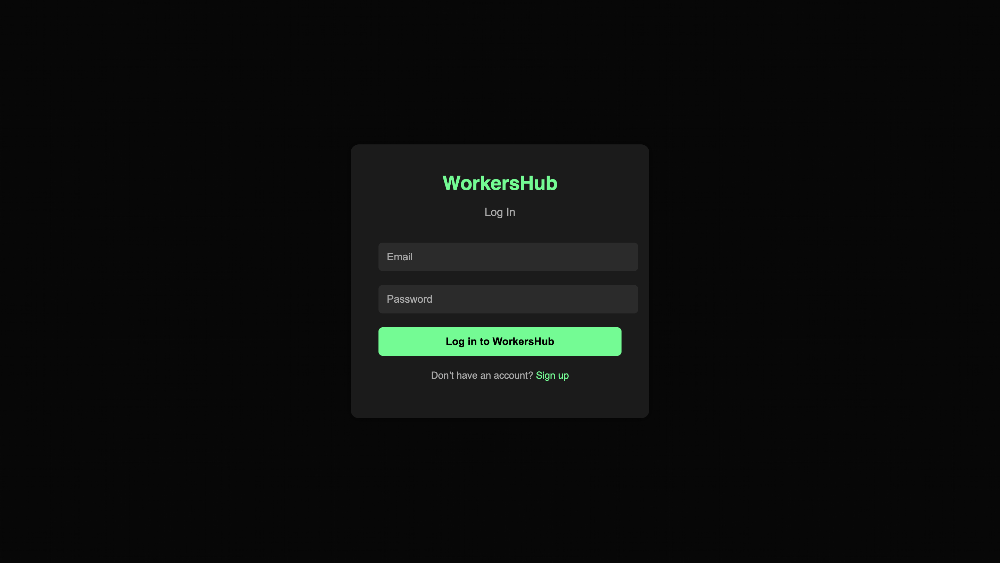
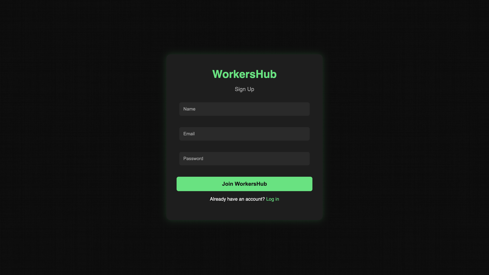
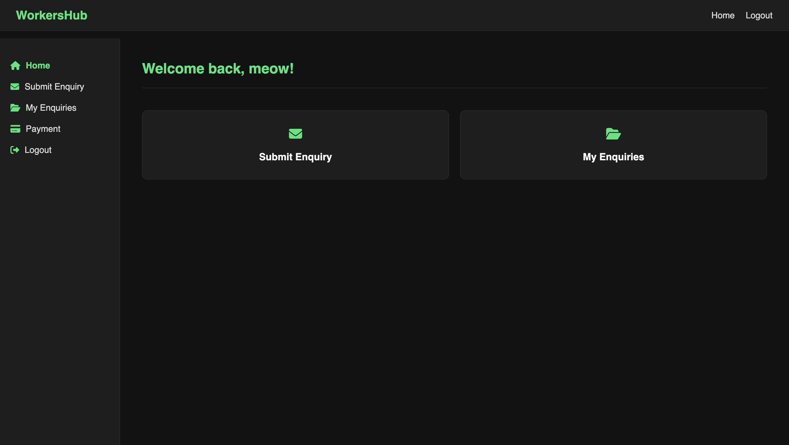
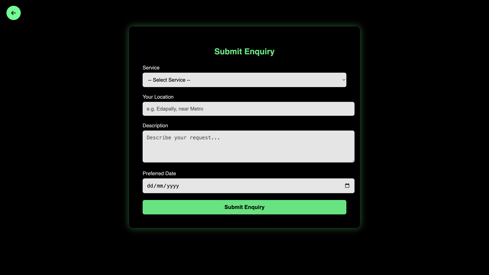
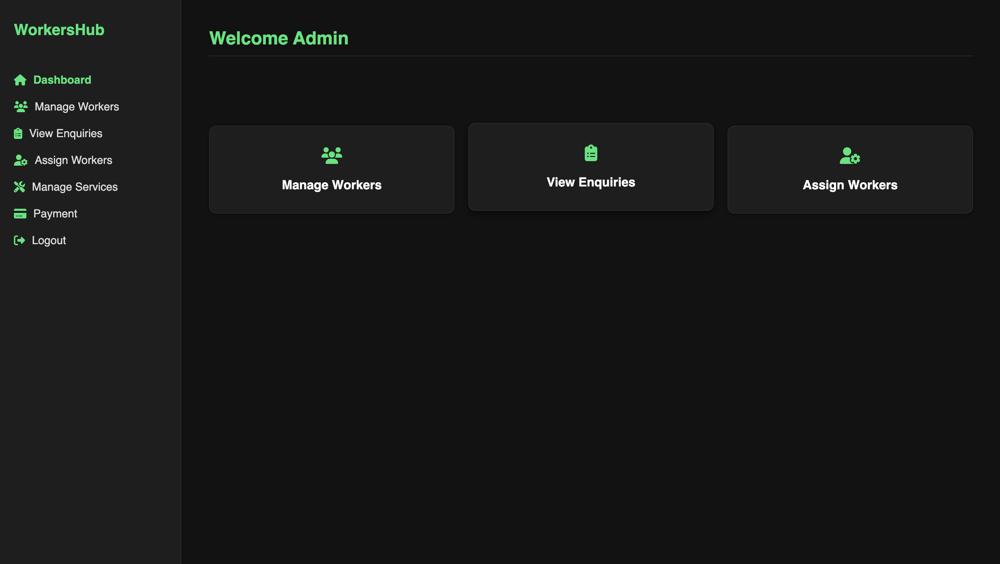
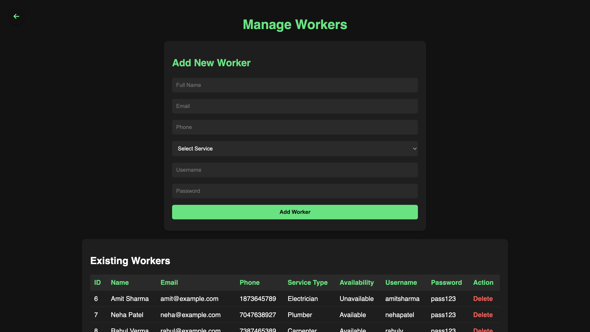
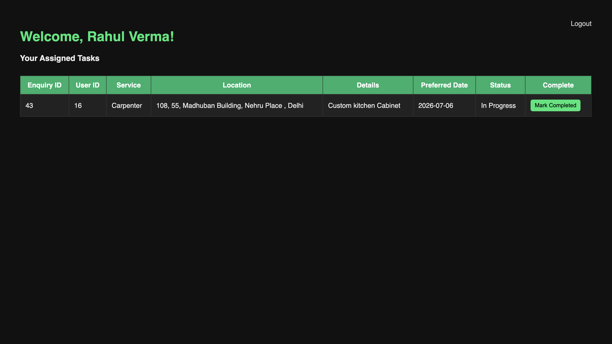
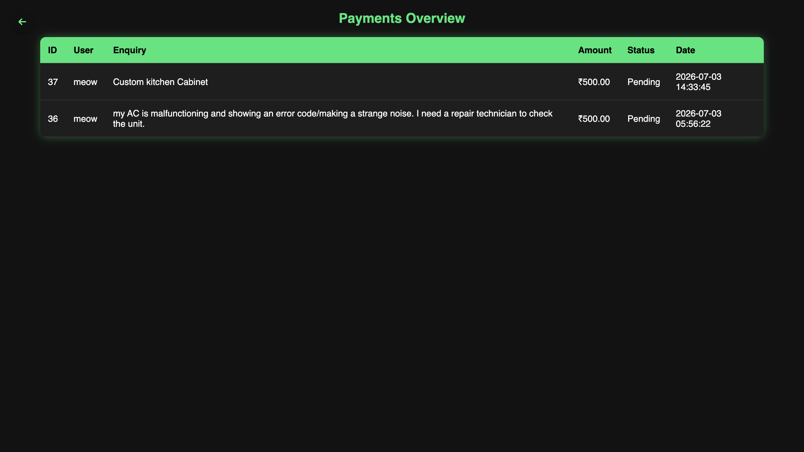

# 🛠️ WorkersHub

A full-stack service management web application built with PHP and MySQL that connects **Users**, **Administrators**, and **Workers** on a single platform. Users can submit service requests, administrators assign workers, workers manage their tasks, and users can track enquiries and payments.

## 🌐 Live Demo

http://workershub.freedev.app/

---

## ✨ Features

### 👤 User Module
- User Registration & Login
- Secure password hashing
- Submit service enquiries
- Track enquiry status
- View and manage payments

### 👨‍💼 Admin Module
- Admin dashboard
- Manage workers
- Manage services
- View all enquiries
- Assign workers
- Update enquiry status
- Payment management

### 👷 Worker Module
- Worker dashboard
- View assigned jobs
- Update job progress
- Automatically become available after job completion

---

## 🛠️ Tech Stack

| Category | Technology |
|----------|------------|
| Backend | PHP |
| Database | MySQL |
| Frontend | HTML, CSS, JavaScript |
| Database Client | TablePlus |
| Cloud Database | Railway |
| Version Control | Git |
| Repository Hosting | GitHub |

---

## 📂 Project Structure

```text
workershub/
│
├── admin_dashboard.php
├── assignworker.php
├── enquiry.php
├── login.php
├── logout.php
├── manage_services.php
├── manage_workers.php
├── myenquiries.php
├── mypayments.php
├── register.php
├── request.php
├── user_dashboard.php
├── worker_dashboard.php
├── db/
│   └── db.php
├── css/
├── screenshots/
├── workershub_db.sql
├── .env.example
├── .gitignore
└── README.md
```

---

## 🚀 Installation

### 1. Clone the repository

```bash
git clone https://github.com/nia-thegreat/workershub.git
```

### 2. Open the project

```bash
cd workershub
```

### 3. Import the Database

Import `workershub_db.sql` into your MySQL server.


### 4. Create a `.env` file

Create a `.env` file in the project root with your own database credentials.

Example:

```env
DB_HOST=localhost
DB_PORT=3306
DB_NAME=workershub_db
DB_USER=root
DB_PASS=your_password
```

> **Note:** Keep your actual credentials private. Do **not** commit the `.env` file to GitHub.

### 5. Start PHP

```bash
php -S localhost:8000
```

Visit:

```text
http://localhost:8000
```

---

## 👥 Demo Accounts


| Role | Email | Password |
|------|-------|----------|
| Admin | admin@gmail.com | admin123 |
| User | meow@gmail.com | pass123 |
| Worker (Carpenter) | rahul@example.com | pass123 |
| Worker (Painter) | sonia@example.com | pass123 |


---

## 📸 Screenshots


### Login Page




### Registration Page




### User Dashboard




### Submit Enquiry




### Admin Dashboard




### Manage Workers




### Worker Dashboard




### Payments Page




---

## 🔐 Security Features

- Password hashing using PHP's `password_hash()`
- Password verification using `password_verify()`
- Prepared SQL statements to reduce SQL injection risk
- Role-based authentication
- Session management
- Environment variables for database configuration

---

## 🔮 Future Improvements

- Online payment gateway integration
- Email notifications
- Service ratings and reviews
- Worker location tracking
- Mobile responsive UI
- Search and filtering
- File upload for service requests

---

## 🎯 Learning Outcomes

This project demonstrates:

- Full-stack web development
- CRUD operations
- Authentication & Authorization
- Session management
- Relational database design
- SQL joins
- Prepared statements
- Password hashing
- Git & GitHub workflow
- Cloud database integration

---

## 👨‍💻 Author

**nia-thegreat**

GitHub: https://github.com/nia-thegreat

---

## 📄 License

This project was developed for educational and portfolio purposes.